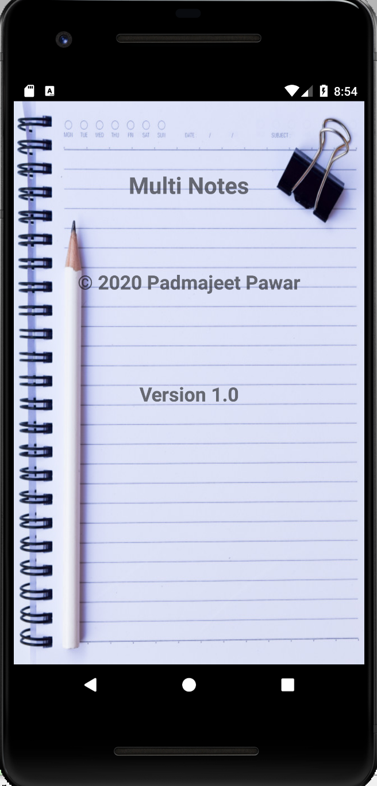
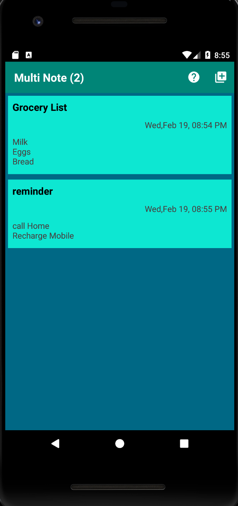

# Multi-Notepad
A Simple multi notes android application 

# Getting Started

- Download/Clone the repository and save project on local disk
- Open the folder using Android Studio
- Run the application using Emulator

# Features
- Quickly create and saves a notes as JSON array

- Beautiful, easy-to-use UI with Material Design elements

- Work with both Landscape and Portrait mode

- Prompts save button if you press back button while writing notes

- Sort notes by date

# App Overview

     

